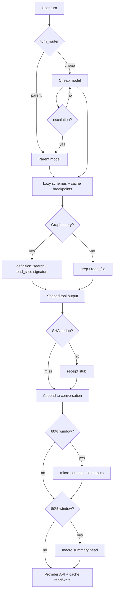

# Squeezy: Unique Cost-Efficiency Features

This document is the short narrative map for Squeezy's cost-saving system. It
describes **what is distinctive about Squeezy's cost architecture** —
implemented mechanisms that compound across layers. It is not a generic "use
smaller prompts" guide, and it is not the canonical detailed audit for any one
mechanism.

Use this file when you want the "why this is different" overview. Use
[`README.md`](README.md) and the numbered chapters for the maintained
chapter-length implementation audit, source references, limits, and tuning
knobs.

---

## 1. Graph-first navigation (not grep-first)

### What

Squeezy answers “where is X defined?”, “who calls it?”, and “what’s the module shape?” through a **local semantic graph** built from tree-sitter ASTs — before the model reads raw files. Lexical tools (`grep`, `glob`, `read_file`) exist but are framed as **graph-anchored fallbacks**, not the primary navigation surface.

The graph powers a dedicated tool family that returns **typed, capped JSON** (symbol IDs, confidence labels, spans) instead of dumping whole files.

### How

**Graph-powered tools** (registered in `crates/squeezy-tools/src/graph_tools.rs`, documented in `crates/squeezy-skills/external-docs/TOOLS.md`):

| Tool | Returns (cost-shaped) |
|------|------------------------|
| `definition_search` | Ranked symbol candidates (BM25 + tier ladder), not file bodies |
| `decl_search` | Declaration lookup by kind/path/language filters |
| `reference_search` | Symbol-bound or heuristic references |
| `symbol_context` | Callers, callees, refs for one symbol — compact JSON packet |
| `upstream_flow` / `downstream_flow` | Bounded call-chain context |
| `hierarchy` | Containment tree for a symbol |
| `repo_map` | Architecture map, language counts, coverage — no source dump |
| `read_slice` | Exact byte/line/symbol slices (see §2) |
| `diff_context` | Git change set + semantic cross-refs |

**Build path:** `squeezy-parse` → `ParsedFile { symbols, calls, references, … }` → `squeezy-graph` edges with confidence (`ExactSyntax`, `ImportResolved`, `CandidateSet`, …) → query via `GraphManager::refresh_before_query()`.

**Example — cross-file question without whole-file reads:**

```json
// Model calls definition_search
{ "query": "verify_token", "max_results": 5 }

// Response (~200–800 tokens): ranked hits with symbol_id, path, signature text, confidence
// Model then calls read_slice with span_kind=signature — ~50–150 tokens, not 7000 for a 1500-line file
{ "symbol_id": "sym:auth/middleware.rs:verify_token", "span_kind": "signature" }
```

**Why this is unique:** Most shell-loop agents navigate via `bash` + `grep` + full `Read`. Squeezy deliberately refuses that as the primary path (see the [semantic graph docs](../SEMANTIC_GRAPH.md)) and bills navigation as **structured graph packets** with explicit recovery (`read_slice` for bodies on demand).

---

## 2. `read_slice` — how it differs from `read_file`

### What

`read_file` returns a **byte window of a path**. `read_slice` returns the **smallest semantically meaningful window** — by symbol, signature vs body, diff hunks, or explicit byte/line range — often **without waiting for the graph** when only a path is needed.

### How

**Dimensions `read_file` does not have:**

| Capability | `read_slice` | `read_file` |
|------------|--------------|-------------|
| Graph-anchored `symbol_id` | Yes — resolves span from `GraphSymbol` | No |
| `span_kind: "signature"` \| `"body"` | Yes — true `signature_span` excludes body bytes | No — always raw bytes |
| `read_mode: "diff"` | Yes — worktree / branch / index / last-receipt baselines | No |
| `diff_only` | Yes — refuses clean files in diff mode | Yes — refuses clean files |
| Path-only fast path | Skips graph build when no `symbol_id` | N/A |
| Resident-read dedup | Stub if prior read already encloses this window | Separate dedup in `file_ops.rs` |
| Auto-widen tight line windows | Pads &lt;40 lines → 48 lines to avoid second call | No |
| Line numbers in content | `cat -n` style with `start_line` | Optional offset only |

**Signature vs body (B1 — real byte saving):**

```rust
// ParsedSymbol carries distinct spans (squeezy-parse)
pub struct ParsedSymbol {
    pub span: SourceSpan,           // whole declaration
    pub body_span: Option<SourceSpan>,
    pub signature_span: Option<SourceSpan>,  // start → body start
    // ...
}

// read_slice Signature case reads signature_span only (graph_tools.rs)
// Bodyless symbols fall back to full span — no silent body ship
```

**Example — signature then body on demand:**

```json
// Turn 1: ~80 tokens
{ "symbol_id": "sym:src/auth.rs:verify_token", "span_kind": "signature" }

// Turn 2 (only if needed): body bytes only
{ "symbol_id": "sym:src/auth.rs:verify_token", "span_kind": "body" }
```

vs `read_file` on the same 1500-line file: ~7000 tokens every time it is re-sent in history.

**Resident-read dedup** (`graph_tools.rs` ~3367–3410): if the model already read bytes `[0, 50000)` and asks for `[12000, 15000)` from the same unchanged file SHA, `read_slice` returns a **receipt stub** pointing at `same_as_call_id` with `bytes_returned: 0` — no re-billing of duplicate content.

**Read routing (§13.4):** on a **single small file**, repeated `read_slice` calls can cost more than one `read_file` because each turn re-bills the growing transcript. Squeezy steers toward one whole-file read in that narrow case; cross-file tasks stay graph-first.

---

## 3. Three-tier conversation shaping (not one “summarize” button)

### What

Squeezy does **not** rely on a single compaction strategy. It runs three complementary mechanisms at different pressure points:

1. **Macro compaction** — fold old turns into a structured summary head; keep recent items + pins.
2. **Micro compaction** — rewrite old tool-output *bodies* in place; preserve call-id pairing.
3. **Expired-context masking** — splice stale file spans out of old reads after a successful edit.

Plus **receipt stubs** (SHA dedup) that run alongside compaction: direct tool paths can return stubs before repeated bytes enter the conversation, and compaction/store layers can replace repeated payloads later.

### How

#### Tier A — Macro compaction (`context_compaction.rs`)

**Trigger:** post-turn only (or via forced overflow). Fires at
`summarize_at_percent` (default **95%**) of the effective window —
`min(model_context_window or fallback_window_tokens, max_context_tokens)` —
once `min_items` (default 16) is satisfied, held 16K below the window so the
next reply fits. Summarize never runs mid-turn; mid-turn pressure is handled
by trim (Tier B).

**What survives:** pinned items + last `keep_recent_items`; dropped slice → synthetic head with `## Goal / ## Progress / ## Decisions / ## Next`, durable tool-call lines, receipt table, file lineage (`<read-files>` / `<modified-files>`), attachment previews.

**Strategies:** `Extractive` (default), `ModelAssisted`, `LayeredFallback` (LLM rewrite only when dropped span exceeds token threshold).

**Undo:** dropped items persisted to checkpoint; `/compact` undo restores verbatim.

```text
Before: [user, assistant, tool×40, user, assistant, …]  → 150k est. tokens
After:  [summary_head, pin, …, last 8 items]              → bounded growth
```

#### Tier B — Micro compaction (`micro_compaction.rs`)

**Trigger:** `trim_at_percent` (default **40%** of the effective window) — *earlier* than macro compaction. Runs both between tool rounds (mid-turn, gated by `enabled_mid_turn`) and as a pre-pass at the post-turn boundary, before the summarize gate is evaluated.

**Mechanism:** replaces `FunctionCallOutput.output` text with `[Old tool output cleared …]` for tools in `COMPACTABLE_TOOL_NAMES`, keeping the **same** `call_id` / `FunctionCall` wrapper (provider-safe).

**Compactable set includes graph packets:**

```rust
const COMPACTABLE_TOOL_NAMES: &[&str] = &[
    "read_file", "read_slice", "shell", "grep", "glob", "webfetch", "websearch",
    "repo_map", "decl_search", "definition_search", "reference_search",
    "upstream_flow", "downstream_flow", "symbol_context", "hierarchy",
    // ...
];
```

**Example:** a 45 KB `symbol_context` from turn 4 is cleared in place at turn 12; the model still sees *that* `symbol_context` ran, but does not re-pay 45 KB on every subsequent prefill.

#### Tier C — Expired-context masking (`micro_compaction.rs` + `lib.rs`)

After **successful** `apply_patch` / `write_file`, changed spans are removed from earlier `read_file` / `read_slice` / `grep` outputs for that path — rewritten to the micro-compact placeholder. **No extra LLM call.**

```text
read_file returned lines 40–60 containing fn old_name()
apply_patch renames old_name → new_name
→ lines 40–60 in that old FunctionCallOutput are spliced to stub; surrounding context kept
```

This attacks **quadratic re-billing** of stale source that SHA-dedup cannot fix (file changed → new hash).

#### Receipt stubs (parallel layer — `context_compaction.rs` + `file_ops.rs`)

On identical `(tool_name, stable_output_sha256)`, direct tool paths,
in-conversation compaction, aggregate packing, and the cross-session receipt
store can emit:

```json
{
  "receipt_stub": true,
  "same_as_call_id": "call_abc123",
  "original_output_sha256": "a1b2c3…",
  "hint": "content unchanged; bytes already in context"
}
```

`read_file` hashes **raw file bytes** (ignores envelope), so offset/limit wrappers still dedup.

---

## 4. Per-turn model rerouting (cheap-model fast path)

### What

The **main user turn** can run on the provider's cheap tier (Anthropic Haiku,
OpenAI `gpt-5.4-mini` by default, Gemini Flash, the Bedrock Haiku variant,
and configured equivalents) when the prompt is an obvious single operation —
with **same-turn escalation** back to the parent model if the cheap tier
struggles. OpenAI/Azure deployments can still route to `gpt-5.4-nano` by
setting `[providers.<name>].cheap_model` or the legacy
`[model].small_fast_model`; the built-in turn-router default favors the
mini tier for reliability.

This is distinct from sub-agent cheap roles (Explorer/Reviewer); it routes the **headline conversation turn** itself.

### How

**Classifier** (`turn_router.rs`):

1. **Heuristic slam-dunk** — single sentence, ≤15 words, imperative whitelist (`run`, `grep`, `checkout`, …), no ambiguity markers (`maybe`, `investigate`, …), no compound connectors (`and verify`, …).
2. **LLM judge** — one JSON call `{"route":"cheap"|"parent"}` on the provider's judge model; OpenAI and Azure use `gpt-5.4-mini` as the built-in judge and built-in routed-turn default; `max_output_tokens = 512`; parse failure → `Parent`.

**Dispatch:** decision sets `current_model` for all rounds in the turn (`lib.rs`).

**Mid-turn escalation** (`EscalationState`) swaps back to parent on:

- tool calls &gt; `max_tool_calls_per_turn / 4`
- `tool_errors + budget_denials ≥ 2`
- refusal phrases in assistant text (`"i'm not sure"`, `"this is complex"`, …)
- tool diversity signal

**Sticky window:** after escalation, next **3** user prompts skip router (force parent).

**Hard exclusions:** image attachments → always parent; `/parent`, `/router off`.

**Example:**

```text
User: "run cargo test -p squeezy-llm"
→ HeuristicSlamDunk("run") → model = provider cheap tier
→ 2 tool rounds, success → turn completes on cheap tier

User: "figure out why auth fails across modules"
→ Heuristic abstains → judge → Parent → Sonnet/Opus
```

**User overrides:** `/cheap`, `/parent`, `/router on|off`.

---

## 5. Provider prompt caching (byte-stable breakpoints)

### What

Squeezy places **explicit cache breakpoints** on supported providers so stable prefixes (system, tool schemas, early history) are billed at cache-read rates — but only when the bytes **before** each marker stay hash-stable across turns.

### How

**Policy** (`cache_policy.rs`):

- `CacheRetention::Short` — Anthropic 5m ephemeral; OpenAI in-memory
- `CacheRetention::Long` — Anthropic `ttl: "1h"`; OpenAI `prompt_cache_retention: "24h"`

**AUTO breakpoints per request:**

The three structural markers are:

1. System tail (array form with marker on last system block)
2. Last **stable** tool definition (MCP tools **excluded** so `tools/list` refresh does not invalidate cache)
3. Latest user message block

When the marker budget has room, Squeezy can also mark an older stable user
block so the settled assistant tail becomes cache-readable on the next turn.

**Stability tactics tied to caching:**

- `<tools_index>` alphabetically sorted (`lazy schema` — §6)
- MCP excluded from breakpoint placement
- OpenAI `text_verbosity` on API param (not system prompt splice) when native API supports it

**Example — Anthropic wire shape:**

```json
{
  "system": [
    { "type": "text", "text": "…agent instructions…" },
    { "type": "text", "text": "…skills stub…", "cache_control": { "type": "ephemeral", "ttl": "1h" } }
  ]
}
```

**Accounting:** `CostSnapshot.cached_input_tokens` + `cache_write_input_tokens` normalized per provider in Chapter 10 extractors.

---

## 6. Lazy tool schemas and skill bodies

### What

Full JSON schemas for ~25+ tools are **not** sent every turn. The model sees a short `<tools_index>` (name + description) and pulls full schemas via `load_tool_schema` only when needed. Skills use the same pattern with `load_skill`.

### How

**Always-core schemas** (`squeezy-agent` tool assembly): bounded I/O, patch, search, shell, **graph navigation** — the tools likely needed every turn.

**Deferred:** `verify`, `webfetch`, `websearch`, `delegate_chain`, heavy MCP tail, etc.

```text
Default wire: ~7–8 KB core schemas + ~2 KB tools index
vs naive:     ~30–80 KB full tool bundle every turn
```

**Session stickiness:** once `load_tool_schema("webfetch")` runs, that schema stays attached for the rest of the session — pay once, cache-hit thereafter.

---

## 7. Structured tool-output shaping and spillover

### What

Raw tool stdout (cargo, pytest, grep) is **shaped** to signal-bearing excerpts; overflow goes to content-addressed tempfiles recoverable via `read_tool_output` — so the conversation carries handles, not megabytes.

### How

| Tool | Shaping |
|------|---------|
| `shell` / cargo | JSON diagnostic extractors; 8k shaped cap; raw sidecar `{call_id}-raw.txt` on overflow |
| `grep` | 48 KB cap, 2000 char/line, `BTreeSet` path dedup; **resident grep** runs regex in-memory if file already read |
| `glob` / reads | `diff_only` skips clean files |
| Images | Magic-byte detect → `LlmInputItem::Image`, not UTF-8 mangling |

**Spillover path:** `$TMPDIR/squeezy-spillover/<session>/<sha-prefix>`, 100 MiB session budget.

**Example:**

```json
// shell result (shaped)
{
  "status": "error",
  "summary": "3 rustc errors in squeezy-tools",
  "errors": [ "…first 3 diagnostics…" ],
  "truncated": true,
  "read_tool_output": { "handle": "spill:a1b2c3", "bytes": 245000 }
}
```

---

## 8. Sub-agent context isolation

### What

Sub-agents (delegate / explore / review) start with **zero parent transcript** — only task prompt + restricted tool allowlist + role model policy. Parent receives a bounded return packet — summary, supporting receipts, files touched, and cost/cache metadata — not the sub-agent’s full tool trace.

### How

```text
Parent context cost for 3 parallel explores:
  Naive: 3 × 30k tool trace merged into parent  → 90k+ added
  Squeezy: 3 × ~8k isolated contexts + 3 × ~0.5k summaries → ~25k equivalent
```

**Per-role reasoning (B2):** Planner `reasoning_effort=High`; Explorer/Reviewer `Low` — cheap tiers do less reasoning work by default.

**Guards:** `SUBAGENT_MAX_CONCURRENT = 20`, `DELEGATE_CHAIN_MAX_STEPS = 16`, no grandchild spawn.

---

## 9. Session resume from compaction checkpoints

### What

Resuming a long session does **not** replay the full `events.jsonl`. Resume snaps to the newest `ContextCompacted` checkpoint and applies only newer events — paying for compacted head + tail, not 100 turns of raw tool output.

### How

```text
.squeezy/sessions/<id>/
  events.jsonl      # append-only audit log
  resume_state.json # snap point
  replay.jsonl      # pre-parsed replay

Resume: find latest context_compacted event → load post_compact conversation → forward-replay Δ events
```

**Cross-session:** `~/.squeezy/memory.md` injected once (capped); `SqueezyStore::put_tool_receipt` enables SHA stubs across sessions in the same workspace.

**Journal checkpoints:** mutating tools snapshot via shadow git — later turns use diffs instead of re-reading entire files.

---

## 10. Pressure governor and token observability

### What

A session **cost cap** can block the *next* provider round at 80% spend (B6) instead of silently degrading mid-turn. `/context` exposes `ConversationShape` — how many bytes are user text vs tool output vs reasoning vs attachments — while `/cost` exposes the running `CostSnapshot` and estimated spend.

### How

`CostBroker::pressure_gate()` enforces the 80% pressure gate when a session
cost cap is configured and the current provider/model has known pricing. The
agent surfaces a clear cost-pressure status instead of starting another
provider round that is likely to cross the cap.

`ConversationShape` breakdown drives tuning: if `tool_output_bytes` dominates, micro-compaction + graph navigation matter more than system prompt edits.

The savings ranges in this directory are illustrative. Re-run the benchmark
report and check current provider pricing before citing live percentages.

---

## How the layers compound (one turn)



---

## Quick reference — “unique vs generic”

| Generic (every agent should) | Squeezy-specific |
|------------------------------|------------------|
| “Don’t read huge files” | `signature_span` + graph symbol IDs + `read_slice` diff modes |
| “Summarize old context” | 3-tier: macro + micro + expired-context masking + receipt stubs |
| “Use a cheaper model sometimes” | Per-turn router with same-turn escalation + sticky parent window |
| “Cache prompts” | MCP-excluded breakpoints + alphabetized tools index for hash stability |
| “Truncate shell output” | Shaped extractors + spillover sidecar + resident grep/read dedup |
| “Use ripgrep” | Graph-first `definition_search` / `symbol_context` with confidence + caps |

---

## Primary source files

| Feature | Files |
|---------|-------|
| Graph tools | `crates/squeezy-tools/src/graph_tools.rs`, `crates/squeezy-graph/` |
| read_slice / signature_span | `crates/squeezy-parse/`, `graph_tools.rs` |
| Macro compaction | `crates/squeezy-agent/src/context_compaction.rs` |
| Micro compaction + expired masking | `crates/squeezy-agent/src/micro_compaction.rs` |
| Receipt dedup | `context_compaction.rs`, `crates/squeezy-tools/src/file_ops.rs`, `crates/squeezy-store/` |
| Turn routing | `crates/squeezy-agent/src/turn_router.rs` |
| Prompt caching | `crates/squeezy-llm/src/cache_policy.rs` |
| Lazy schemas | `crates/squeezy-agent/src/lib.rs`, `crates/squeezy-skills/` |
| Output shaping | `crates/squeezy-tools/src/shell_output.rs`, `shell_spillover.rs` |
| Sub-agents | `crates/squeezy-agent/src/subagent_catalog.rs`, `roles.rs` |
| Sessions / resume | `crates/squeezy-store/src/sessions.rs` |
